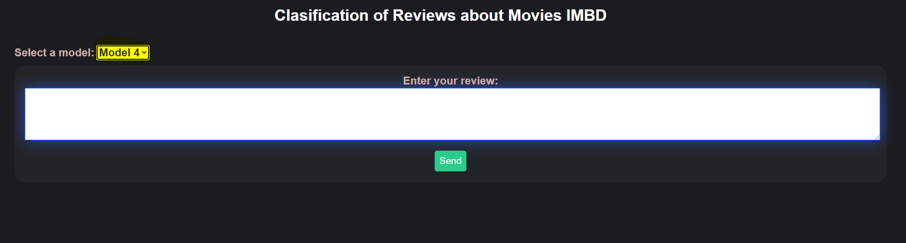
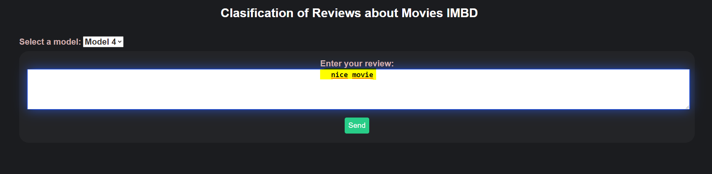
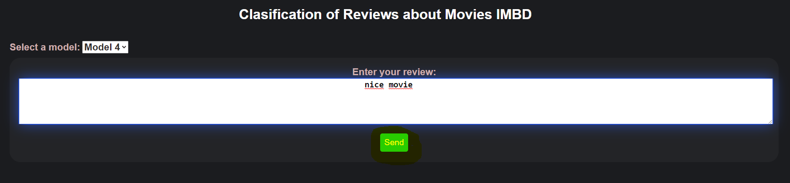
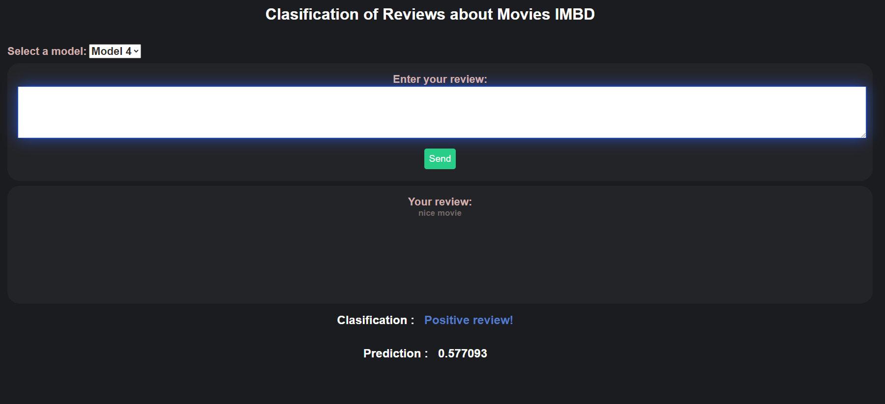

# Clasification of Reviews about Movies IMBD

A review sentiment classification model is implemented using different preprocessing and training methods. The IMDB dataset, which consists of movie reviews labeled as positive or negative, is used. First, the dataset is loaded and preprocessed. Then, the model is built, compiled and trained using the training set
.

The application will classify positively or negatively the review that is entered, you can use different models in total 4 that were used to preprocess and train with data from the IMBD dataset.

1. Select the model to use

2. Write a review 

3. Click button a "Send" 

You review is clasificated 

